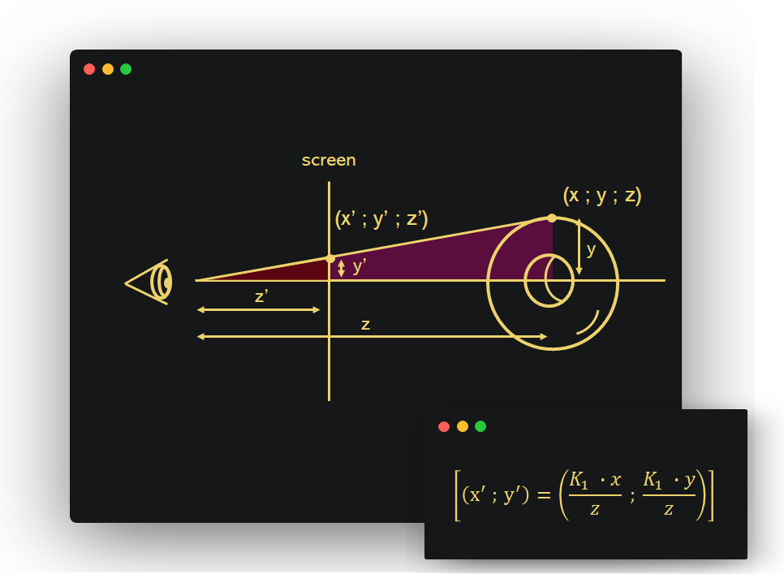

# Sprint 2 Review Ticket

## Section 1: Lesson Review

For this sprint 2 unit, my team and I taught Unit 2 of CollegeBoard's AP Computer Science A course. In this Unit I made the section which tought Non-Void methods and method signatures. One highlihgt from my lesson was my development of the method golf game.

<html lang="en">
<head>
    <meta charset="UTF-8">
    <meta name="viewport" content="width=device-width, initial-scale=1.0">
    <title>Method Golf</title>
    <style>
        .game-container {
            background-color: #000000;
            box-shadow: 0 4px 8px rgba(0, 0, 0, 0.1);
            padding: 30px;
            border-radius: 10px;
            width: 400px;
            text-align: center;
        }
        input {
            width: calc(100% - 20px);
            padding: 10px;
            font-size: 1em;
            border: 2px solid #3498db;
            border-radius: 5px;
            margin-bottom: 20px;
            outline: none;
            transition: border-color 0.3s;
        }
        input:focus {
            border-color: #2980b9;
        }
        button {
            background-color: #3498db;
            color: white;
            padding: 10px 20px;
            font-size: 1em;
            border: none;
            border-radius: 5px;
            cursor: pointer;
            transition: background-color 0.3s;
        }
        button:hover {
            background-color: #2980b9;
        }
        .feedback {
            font-size: 1.2em;
            font-weight: bold;
            color: #e74c3c;
            margin-top: 15px;
        }
        .correct {
            color: #2ecc71;
        }
        .hidden {
            visibility: hidden;
        }
    </style>
</head>
<body>
    <div class="game-container">
        <h1>Method Golf</h1>
        <div id="level-box" class="level-box">
            <h2 id="level-title">Level 1</h2>
            <p id="signature">Signature: <code>int add(int a, int b)</code></p>
            <p id="hint">Call the method with: <code>(1, 2)</code></p>
            <input type="text" id="user-input" placeholder="Enter your function call here">
            <button onclick="checkAnswer()">Submit</button>
            <div id="feedback" class="feedback hidden"></div>
        </div>
    </div>

    <script>
        const levels = [
            {
                signature: "int add(int a, int b)",
                hint: "Call the method with: (1, 2)",
                correctCall: "add(1, 2);"
            },
            {
                signature: "String greet(String name)",
                hint: 'Call the method with: ("Alice")',
                correctCall: 'greet("Alice");'
            },
            {
                signature: "boolean isEven(int number)",
                hint: "Call the method with: (4)",
                correctCall: "isEven(4);"
            },
            {
                signature: "void printMessage(String message)",
                hint: 'Call the method with: ("Hello!")',
                correctCall: 'printMessage("Hello!");'
            },
            {
                signature: "double multiply(double x, double y)",
                hint: "Call the method with: (2.5, 3.0)",
                correctCall: "multiply(2.5, 3.0);"
            },
            {
                signature: "char firstLetter(String word)",
                hint: 'Call the method with: ("Golf")',
                correctCall: 'firstLetter("Golf");'
            }
        ];

        let currentLevel = 0;

        function loadLevel() {
            const level = levels[currentLevel];
            document.getElementById('level-title').textContent = `Level ${currentLevel + 1}`;
            document.getElementById('signature').innerHTML = `Signature: <code>${level.signature}</code>`;
            document.getElementById('hint').innerHTML = level.hint;
            document.getElementById('user-input').value = '';
            document.getElementById('feedback').textContent = '';
            document.getElementById('feedback').classList.add('hidden');
        }

        function checkAnswer() {
            const userInput = document.getElementById('user-input').value.trim();
            const correctCall = levels[currentLevel].correctCall;

            const feedbackEl = document.getElementById('feedback');
            if (userInput === correctCall) {
                feedbackEl.textContent = 'Correct! Hole in one!';
                feedbackEl.classList.remove('hidden', 'feedback');
                feedbackEl.classList.add('correct');
                currentLevel++;
                if (currentLevel < levels.length) {
                    setTimeout(loadLevel, 1000); // load next level after 1 second
                } else {
                    feedbackEl.textContent = 'Congratulations! You completed all levels!';
                }
            } else {
                feedbackEl.textContent = 'Incorrect! Try again.';
                feedbackEl.classList.remove('hidden', 'correct');
                feedbackEl.classList.add('feedback');
            }
        }

        window.onload = loadLevel;
    </script>
</body>
</html>

This game consisted of 6 levels and was used as one of the mini games with the basketball idea to create a fun experience for the class. I also used the Rubiks cube to further my explanations

My thought process:
1. 🕹️ Turn the lesson into a game
2. 🔢 Use extremes to emphasize key points (e.g. If you don't learn methods you will get a 1)
3. 📱 Use an example the audience can visualize

Some potential improvements as discussed with Mr. M:
1. ❓ Maybe apply a better analogy for static vs reference methods
2. 👋 Be more open to the class. Go around and start getting involved in conversations with people if they need help
3. 💻 Make sure to maybe cut down on some unnecessary bits and not go in depth


## Section 2: Grading Review

In terms of grading, this was my team's philisophy:

```
4+ -> 0.95 -> above and beyond (rare)
4 -> 0.9 -> meets expectations
3 -> 0.85 -> missing some things
2 -> 0.75 (?) -> missing lots of things
1 -> 0.55 -> incomplete/didn't do it
```

In terms of what would impress us, my team was transparent in the sense that we would give extra points based on originality, effort, and output. This was all done while making sure that the average is intact to prevent grade inflation.

## Section 3: Homework Review

In terms of my homework, these are somethings I did well but some things I could also improve upon

✅ Went Great:
1. 🅰️ I scored 0.97 on 2 homeworks (highest in period 3). Everytime I go back to review the comments and it turns out that graders were impressed when I showed them something visually appealing which showed effort and was original
2. 🤚 I engaged in all of the lessons and contributed to my team during jeopardies. As someone on the front lines, I won most of the team teach games!


❌ Could Improve Upon:
1. 🙁 I submitted one homework late! What is the point of putitng in so much effort if what I submitted got late credit??
2. 🙁 For the last two hacks, I forgot to make a sort of section menu on my homework page. I just don't think it would be fair for graders to have to hunt through 1 student's homework

### Favorite Memory from Homework: The Spinning Donut 🍩

I created a Java implementation of a spinnign donut animation! It must be run on a java file because the output is updated in real time to create the effect.



Inspired by `donut.c` and an article about how it works

https://www.a1k0n.net/2011/07/20/donut-math.html

```java
import java.util.Arrays;

final int screen_size = 40;
final double theta_spacing = 0.07;
final double phi_spacing = 0.02;
final char[] illumination = { '.', ',', '-', '~', ':', ';', '=', '!', '*', '#', '$', '@' };

double A = 1;
double B = 1;
final double R1 = 1;
final double R2 = 2;
final double K2 = 5;
final double K1 = screen_size * K2 * 3 / (8 * (R1 + R2));

char[][] renderFrame(double A, double B) {
    double cos_A = Math.cos(A);
    double sin_A = Math.sin(A);
    double cos_B = Math.cos(B);
    double sin_B = Math.sin(B);

    char[][] output = new char[screen_size][screen_size];
    double[][] zbuffer = new double[screen_size][screen_size];
    for (char[] row : output) Arrays.fill(row, ' ');
    for (double[] row : zbuffer) Arrays.fill(row, 0);

    double[] cos_phi = new double[315];
    double[] sin_phi = new double[315];
    for (int i = 0; i < cos_phi.length; i++) {
        double phi = i * phi_spacing;
        cos_phi[i] = Math.cos(phi);
        sin_phi[i] = Math.sin(phi);
    }

    double[] cos_theta = new double[90];
    double[] sin_theta = new double[90];
    for (int i = 0; i < cos_theta.length; i++) {
        double theta = i * theta_spacing;
        cos_theta[i] = Math.cos(theta);
        sin_theta[i] = Math.sin(theta);
    }

    double[] circle_x = new double[90];
    double[] circle_y = new double[90];
    for (int i = 0; i < 90; i++) {
        circle_x[i] = R2 + R1 * cos_theta[i];
        circle_y[i] = R1 * sin_theta[i];
    }

    for (int i = 0; i < 90; i++) {
        for (int j = 0; j < 315; j++) {
            double x = cos_B * cos_phi[j] + sin_A * sin_B * sin_phi[j];
            double y = sin_B * cos_phi[j] - sin_A * cos_B * sin_phi[j];
            double z = K2 + cos_A * sin_phi[j];
            double ooz = 1 / z;

            int xp = (int) (screen_size / 2 + K1 * ooz * (x - circle_y[i] * cos_A * sin_B));
            int yp = (int) (screen_size / 2 - K1 * ooz * (y + circle_y[i] * cos_A * cos_B));

            double L = ((cos_phi[j] * cos_theta[i] * sin_B) - cos_A * sin_phi[j] * cos_theta[i] - sin_A * sin_theta[i]) + cos_B * (cos_A * sin_theta[i] - sin_phi[j] * cos_theta[i] * sin_A);
            int L_val = (int) Math.round(L * 8);

            if (L_val >= 0 && ooz > zbuffer[xp][yp]) {
                zbuffer[xp][yp] = ooz;
                output[xp][yp] = illumination[L_val % illumination.length];
            }
        }
    }

    return output;
}

void pprint(char[][] array) {
    for (char[] row : array) {
        for (char c : row) {
            System.out.print(c);
        }
        System.out.println();
    }
}

long startTime = System.currentTimeMillis();
final int duration = 10000;
A = 1;
B = 1;

while (System.currentTimeMillis() - startTime < duration) {
    A += theta_spacing;
    B += phi_spacing;
    System.out.print("\033[H");
    char[][] frame = renderFrame(A, B);
    pprint(frame);
    Thread.sleep(30);
}
```


## Closing Remarks

Overall, I feel like this Sprint 1 was very challenging for me in the sense that I knew I had to improve on soft skills. I tried to do this by talking to the class as I would explain Java to a friend as oposed to how I would explain Java in a job interview. 
