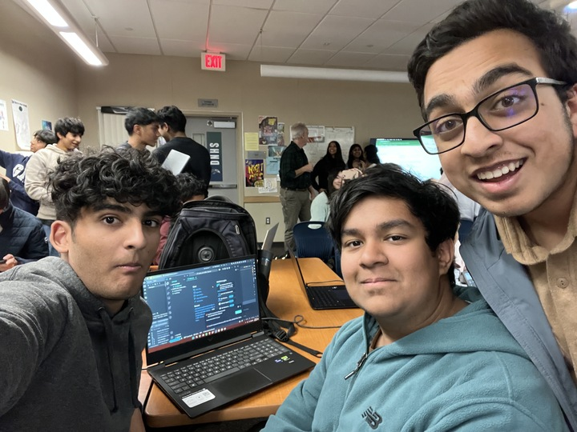

## Key Takeaways 🗝️

For this panel meeting, the main key lesson which I learned was the importance of presentation over code. One idea which really resonated with me is that people will not care about how much code I write or how it looks as long as it gets the job done. I also saw the importance of flowcharts and how it could help me chart out control flow

## Summary ➕

For this class, I have made many flowcharts before. I think one important skill I am trying to grasp is to make a flowchart before attacking a huge task. I feel like for my media bias game, making a flowchart could have saved a lot of time during production.

