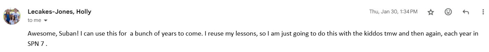

# Final Reflection

## Core Skills

Every trimester, I think there are these recurring skills:

- 🤝 Soft Skills & Collaboration
- ⌨️ Tech Skills

Here is how I addressed these skills this tri, and then how this is an improvement from the last tri.

## Soft Skills

Trimester 1: I was pretty awkward in this trimester. I just wanted to code command line tools and learn Java. I was not too interested in the project aspect of CS. I would have never even imagined talking to another teacher let alone working alongside one.

Trimester 2: I worked closely alongside Profe LeCakes as a customer to develop and actual full stack application. I was able to gather feedback from multiple peers, an facillitate a lot of feedback sessions and even bug report campagins.

## Tech Skills

Trimester 1: Trimester 1 was a shallow introduction to actual Java and not much was explained in terms of use. I had made a calendar, but it did not feel liek it had any actual use. Talking to customers and releasing patches is an actual technical skill.

Trimester 2: I actually felt like a game devloper. Gathering feedback, finding bugs, submitting pull requests, comign up with patch fixes, working with customers. It expanded my knowledge of sort of what to expect in an actual computer science job

## Improvement for the Future

Although I collaborated with Profe LeCakes and other students, I still felt like I was the only one working on my project. It was good because I was able to own up to something and handle the workload, while maybe collaborating for integration purposes, but I don't think I actually had a partner to collab with.

I could have possibly maybe asked another person who may have been unavailable to help out with the media bias game and gotten more collaboration experience.
