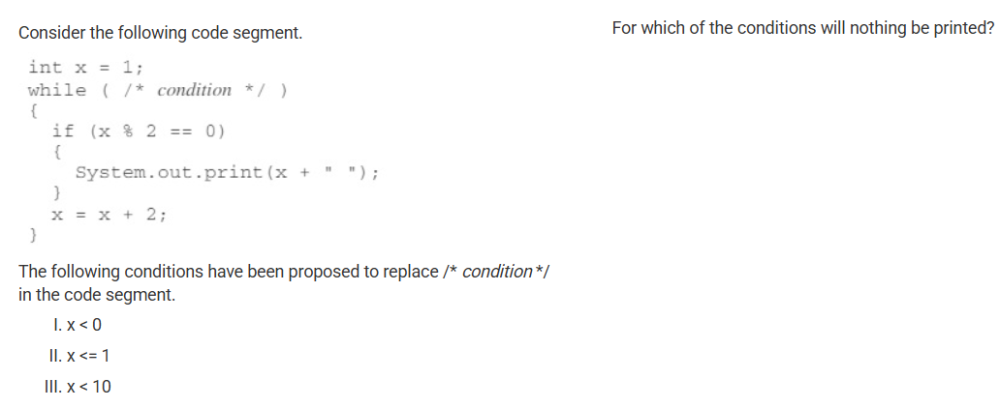
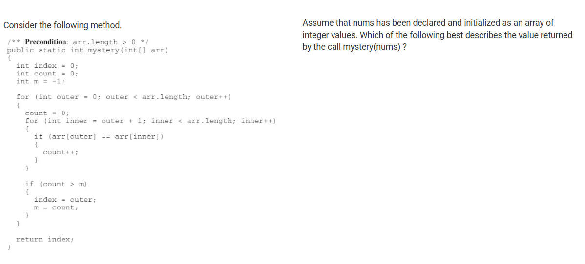
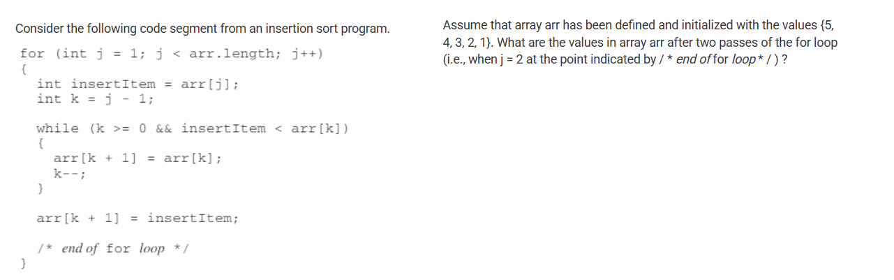
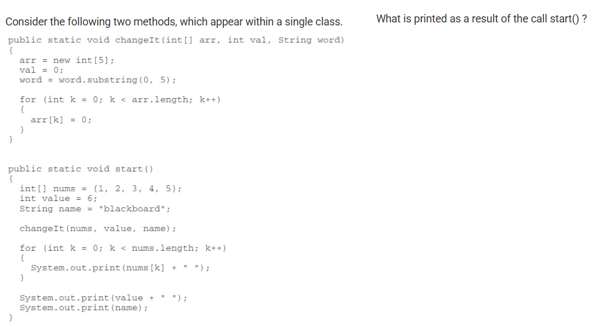
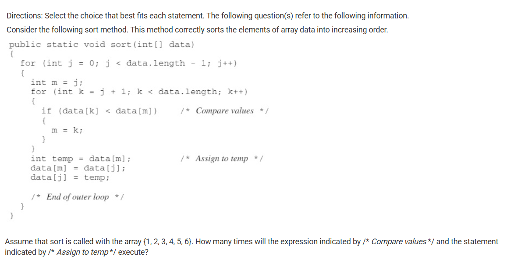
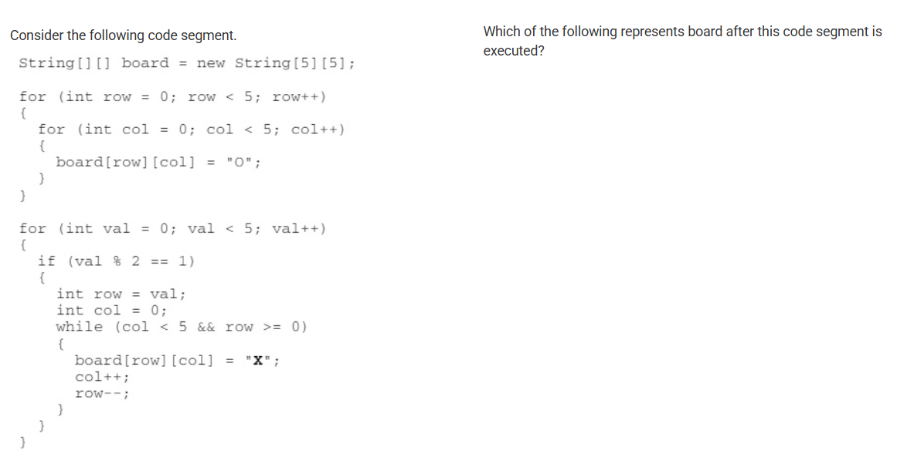

## Question 19: Loop that prints nothing

I chose answer C which was only I and II. The correct answer was E with I, II, and III. I think the reaosn why I made this mistake was mainly because I ignored the logic which controlled the looping. The indexing started from  and kept adding 2 so there would never be an even number output.

## Question 20: Nested Iteration

Since the algorithm is counting the number of elements that are equal to the element at the current value of outer, the index being returned could be a value in nums that is less than the maximum value. I should have read this question more carefully.

## Question 23

This insertion sort method begins sorting the array from the beginning putting the first three numbers in order during the first two passes. Only 3, 4, and 5 will be in the right order. I think I should have paper for this problem

## Question 26

Incorrect. This would be the result if the first line in changeIt (arr = new int[5];) was removed.  Parameters are passed using call by value. Call by value initializes the formal parameters (arr, val, word) with copies of the actual parameters (nums, value, name). When the parameter is a reference variable, the method receives a reference and can mutate the object being referenced but cannot alter the reference itself. Changing the reference stored in arr in changeIt does not affect the reference stored in nums in start so subsequent changes to the elements in arr are made in the new array not in nums. I should have used pencil and paper.

## Question 28

Incorrect. The outer loop iterates one fewer time than the length of the array. The inner loop is dependent on the outer loop, starting at the value of j + 1 and iterating to the end of the array. The first pass through the outer loop, the inner loop will iterate five times, meaning the /* Compare values */ expression will execute five times. Each subsequent iteration will result in one fewer iterations of the inner loop. Therefore, we will evaluate the /* Compare values */ expression 5 + 4 + 3 + 2+ 1 or 15 times. I should have spent more time.

## Question 31

Incorrect. This image would require loops across the entire board with alternating checks for when rows and columns were even or odd. I should have made this more step by step.

