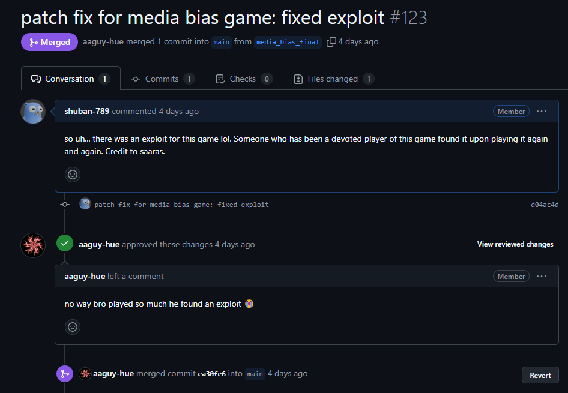

# Project Debrief

## What?

This trimester I worked with Profe LeCakes to come up with a media bias game for her class to play. I reached out to her directly, talked to her in person, and spent the remaining time in the trimester to improve the game with features such as:

- Login support
- Accessible leaderboard
- Randomization for anti-cheat

## Feedback

Most of the feedback which I recieved were by people playing my game at night at the museum. This was when Saaras actually told me about a bug in my game, which I will talk about in the patch fix debrief.

I also had a reciprocal feedback session with Jason which gave me some more feedback going into Night at the Museum. It was with this feedback that I was able to accomplish so many tasks.

## Patch Fixes (2/28)

Saaras, a devoted player, found a bug in my game after playing it for so long. The issue was that the randomization algorithm was not too effective. I just forgot to rescramble. The bug s now officially fixed.

