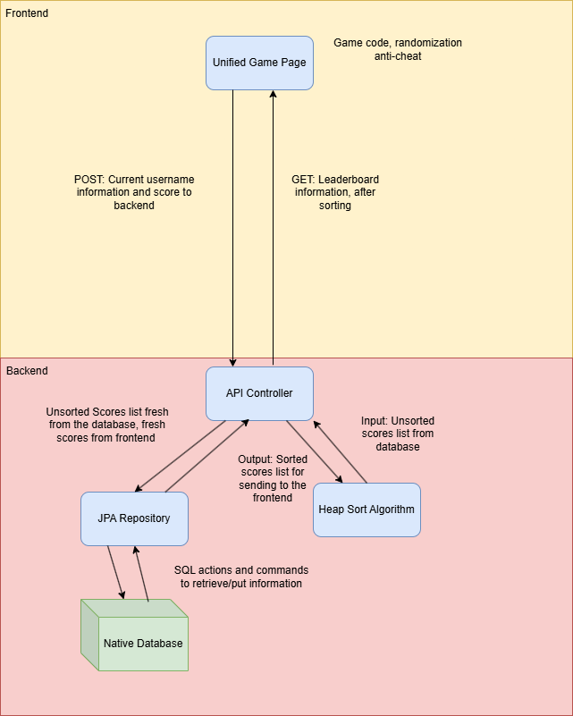

# Feature Writeup

## Drawio Diagram

## Overview of the Media Bias Game

- Players are give a selection of multiple news outlets to choose from
- They must successfully sort all of the outlets in terms of bias for points
- A higher accuracy will result in a higher point count.

## Backend

- Heap sort algorithm sorts scores on the leaderboard
- Everytime a score is submitted via POST, the backend captures it and feeds it into the database
- Everytime the leaderboard needs to be shown, the current leaderboard is fetched via GET

## Frontend

- The actual logic for the game lies in the frontend
- An algorithm is used to randomize the news outlets and make the game more fair
- Accessible UI and leaderboard, scores are sent and retrieved from the database.

