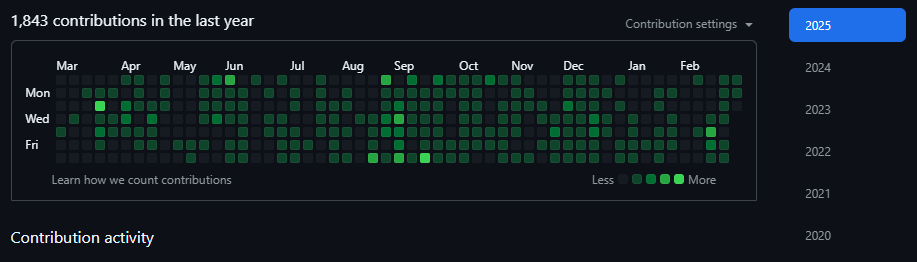
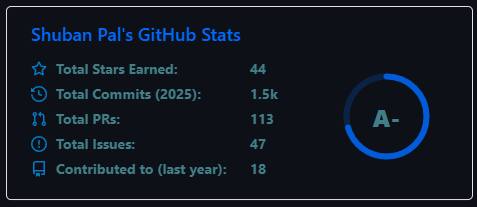
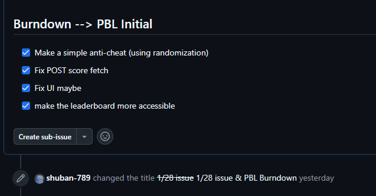
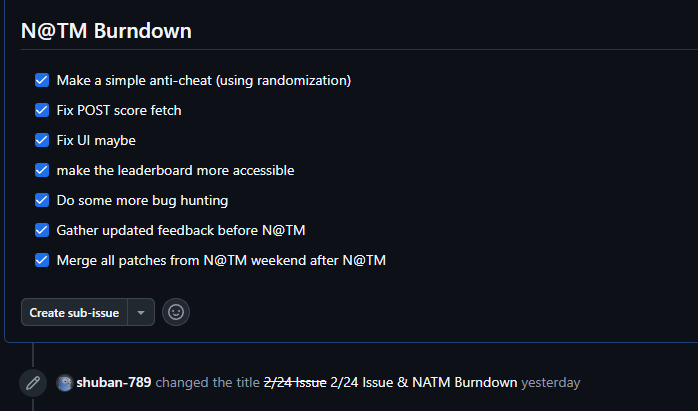
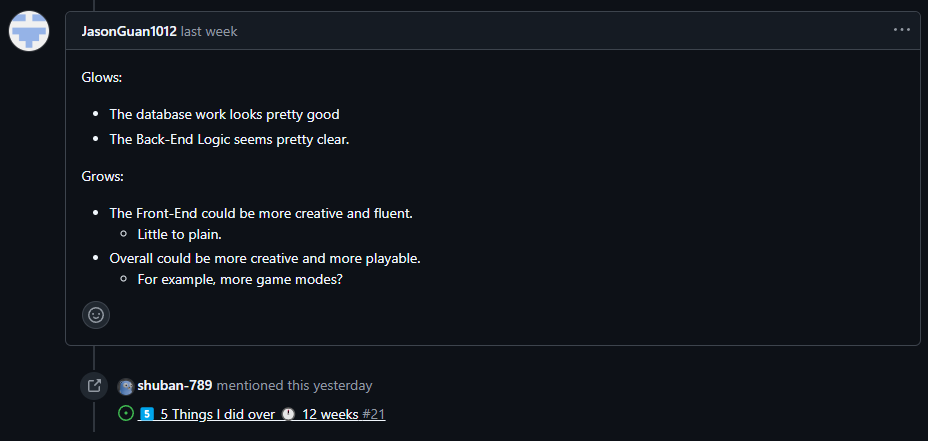
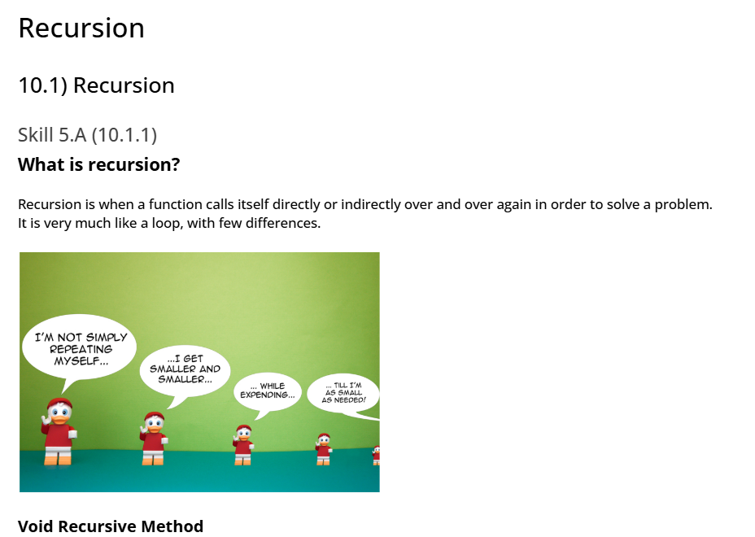
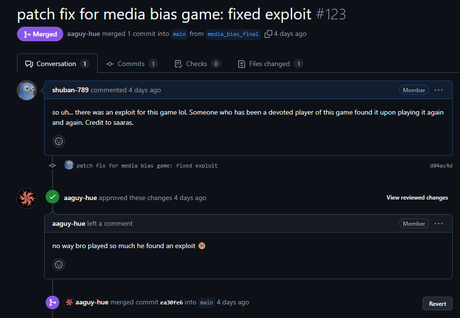
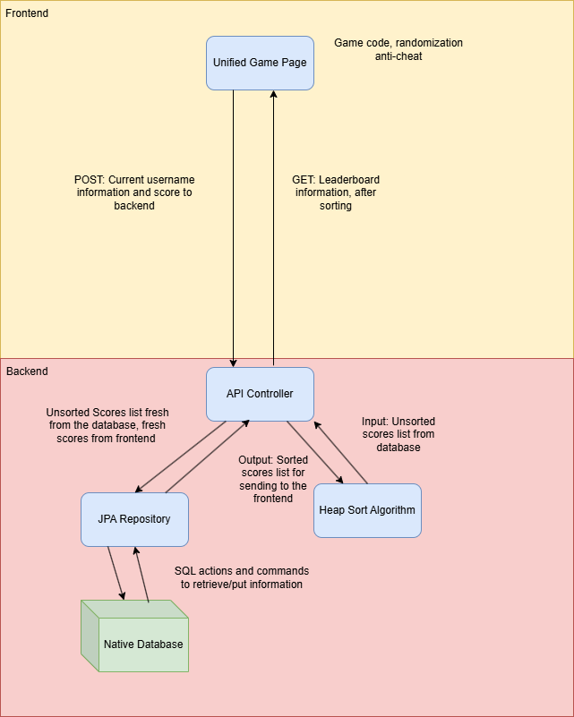
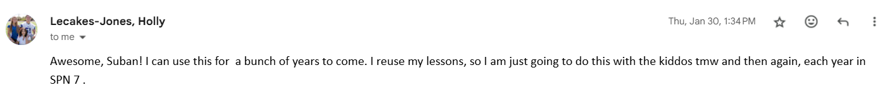

# 5 Things

## 1️⃣ Fullstack Feature:  Media Bias Game (0.94/1)

## 2️⃣ Analytics (0.94/1)

## 3️⃣  Burn Down Lists (0.92/1)

I wanted to finish my burndown lists even after night at the museum. I think this showed a level of dedication.

## 4️⃣  Key Issues (0.93/1)

## 5️⃣ Recursion Lessons  (0.9/1)
- [Recursion Video](https://www.youtube.com/watch?v=ddfWs8MPpVI)
- [Recursion Planning Tangible](https://docs.google.com/document/d/1qrtdBshnjiBC4JltyNXviOsJ-J9cuNABklN11o7Pjgw/edit?usp=sharing)

# MCQ + FRQ

- 📝 [2015 Practice Exam FRQ Reflection](https://shuban-789.github.io/Shuban-CSA/2025/03/04/mcq_IPYNB_2_.html)
- 📝 [2015 Practice Exam MCQ Reflection](https://shuban-789.github.io/Shuban-CSA/2025/03/04/mcq_IPYNB_2_.html)

# Project Debrief

## What?

This trimester I worked with Profe LeCakes to come up with a media bias game for her class to play. I reached out to her directly, talked to her in person, and spent the remaining time in the trimester to improve the game with features such as:

- Login support
- Accessible leaderboard
- Randomization for anti-cheat

## Feedback

Most of the feedback which I recieved were by people playing my game at night at the museum. This was when Saaras actually told me about a bug in my game, which I will talk about in the patch fix debrief.

I also had a reciprocal feedback session with Jason which gave me some more feedback going into Night at the Museum. It was with this feedback that I was able to accomplish so many tasks.

## Patch Fixes (2/28)

Saaras, a devoted player, found a bug in my game after playing it for so long. The issue was that the randomization algorithm was not too effective. I just forgot to rescramble. The bug s now officially fixed.

# Feature Writeup

## Drawio Diagram

## Overview of the Media Bias Game

- Players are give a selection of multiple news outlets to choose from
- They must successfully sort all of the outlets in terms of bias for points
- A higher accuracy will result in a higher point count.

## Backend

- Heap sort algorithm sorts scores on the leaderboard
- Everytime a score is submitted via POST, the backend captures it and feeds it into the database
- Everytime the leaderboard needs to be shown, the current leaderboard is fetched via GET

## Frontend

- The actual logic for the game lies in the frontend
- An algorithm is used to randomize the news outlets and make the game more fair
- Accessible UI and leaderboard, scores are sent and retrieved from the database.

# Final Reflection

## Core Skills

Every trimester, I think there are these recurring skills:

- 🤝 Soft Skills & Collaboration
- ⌨️ Tech Skills

Here is how I addressed these skills this tri, and then how this is an improvement from the last tri.

## Soft Skills & Collaboration

Trimester 1: I was pretty awkward in this trimester. I just wanted to code command line tools and learn Java. I was not too interested in the project aspect of CS. I would have never even imagined talking to another teacher let alone working alongside one.

Trimester 2: I worked closely alongside Profe LeCakes as a customer to develop and actual full stack application. I was able to gather feedback from multiple peers, an facillitate a lot of feedback sessions and even bug report campagins.

## Tech Skills

Trimester 1: Trimester 1 was a shallow introduction to actual Java and not much was explained in terms of use. I had made a calendar, but it did not feel liek it had any actual use. Talking to customers and releasing patches is an actual technical skill.

Trimester 2: I actually felt like a game devloper. Gathering feedback, finding bugs, submitting pull requests, comign up with patch fixes, working with customers. It expanded my knowledge of sort of what to expect in an actual computer science job

## Improvement for the Future

Although I collaborated with Profe LeCakes and other students, I still felt like I was the only one working on my project. It was good because I was able to own up to something and handle the workload, while maybe collaborating for integration purposes, but I don't think I actually had a partner to collab with.

I could have possibly maybe asked another person who may have been unavailable to help out with the media bias game and gotten more collaboration experience.

# Final Evalution

| Criteria                               | Points Possible | Points Earned | My Reflection |
|----------------------------------------|----------------|---------------|---------------|
| 5 Things Over 12 Weeks                 | 5              | 4.63           | I think especially this trimester I have really felt the grind behind AP CSA. I know in the beginning of the trimester I was onto a bit of a rough start, but I tackled a new style of development which changed my entire perspective on project based learning. Everything I could have imagined in an actual corporate job such as talking to customers, releasing patch updates, review meetings. It all felt real. I think this trimester I really did my part to embrace this culture too.  |
| Full Stack Feature Demo                | 2              | 1.9           | N@TM went really well. I had the same mindset of a game developer and tried to make sure if anyone could not only beat my game, but maybe give feedback on what to fix if the game looks broken to some extent. I actually found a bug in my game while Saaras, a devoted player, found while playing my game over and over again. This bug was with the randomization pattern of the tiles which could cause some players to get 23 every single time. I released a patch update for this right after N@TM was over. |
| Key Feature Blog & Visualization       | 1              | 0.92          | I created two diagrams for how my one feature works and included background information. However, the entire writeup isn’t completed just yet, which is why I’m docking myself a little bit. |
| FRQ/MCQ                                | 1              | 0.93             | I completed the reflections for the MCQ and FRQ on time. I probably could have done way more MCQs and FRQs though as practice made perfect. 3 was probably not enough. |
| The Tenth Point                        | 1              | 0.93           | I had a pretty solid plan for what I will complete in Trimester 3, as well as a genuine reflection on the good things and bad things of each trimester.  |
| **Total**                              | **10**         | **9.31**      | I've made solid progress given my limited time on the Database Persistence project, and I believe I met each criterion (mostly) to the full. |
