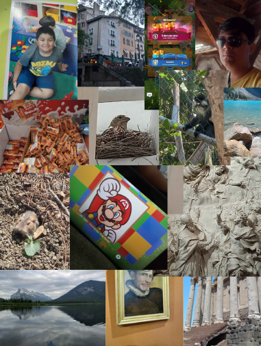

## My Interests

- ⌨️ Coding
- 🤖 Robotics
- 🔐 Cybersecurity
- 🎮 Gaming

## My Computer Science Backgrounds

## 🌏 My Cultural Background

- 2nd generation Indian American
- I have lived in San Diego all my life
- My favorite Indian dish is butter paneer with garlic naan

<head>
    <meta charset="UTF-8">
    <meta name="viewport" content="width=device-width, initial-scale=1.0">
    <title>Shuban's Quiz</title>
</head>
<body>
    <h1>📝 Shuban's "About Me" Quiz</h1>
    <section>
        <form id="quizForm">
            <h3>1️⃣ What is Shuban's favorite Indian dish?</h3>
            <input type="radio" name="q1" value="wrong1"> Garlic Naan and Butter Chicken 
            <input type="radio" name="q1" value="wrong2"> Lemon Rice 
            <input type="radio" name="q1" value="correct"> Garlic Naan and Butter Paneer 
            <input type="radio" name="q1" value="wrong3"> Samosa 

            <h3>2️⃣ What ethnicity is Shuban?</h3>
            <input type="radio" name="q2" value="wrong1"> 1st Generation Italian American 
            <input type="radio" name="q2" value="wrong2"> 1st Generation Indian American 
            <input type="radio" name="q2" value="correct"> 2nd Generation Indian American 
            <input type="radio" name="q2" value="wrong3"> 2nd Generation Japanese American 

            <h3>3️⃣ What is not a language which Shuban knows?</h3>
            <input type="radio" name="q3" value="correct"> C++ 
            <input type="radio" name="q3" value="wrong1"> Python 
            <input type="radio" name="q3" value="wrong2"> Go 
            <input type="radio" name="q3" value="wrong3"> C 

            <h3>4️⃣ What is one game Shuban plays on Nintendo Switch?</h3>
            <input type="radio" name="q4" value="wrong1"> Zelda: Breath of the Wild 
            <input type="radio" name="q4" value="wrong2"> Animal Crossing 
            <input type="radio" name="q4" value="correct"> Mario Odyssey 
            <input type="radio" name="q4" value="wrong3"> Mario Kart 8 Deluxe  

            <button type="button" onclick="checkAnswers()" type="button" class="button">Submit</button>
        </form>

        

    </section>

    
</body>